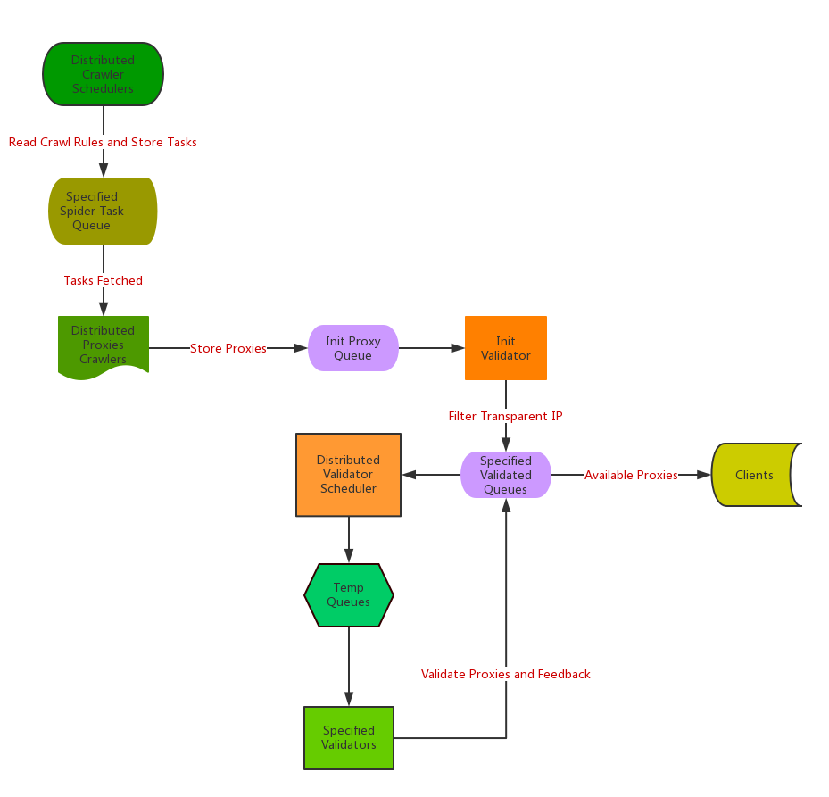

# HAipproxy
[README](README.md) | [中文文档](README_ZH.md)

本项目所采集的IP资源都来自互联网，愿景是为大型爬虫项目提供一个**高可用低延迟的高匿IP代理池**。

# Features
- 快速抓取代理IP。使用scrapy做高速网络请求，能快速填充IP代理池。
- IP抓取和提取精准。对于诸如[全网代理IP](http://www.goubanjia.com/)
这类做了前端混淆的加密网站几乎没做还原处理。某些网站页面结构看似单一，却暗含陷阱。此外，还有一些网站本身就会限制请求次数。
本项目有效地解决了这三个问题。想知道细节的请点击[这里]()
- IP来源丰富。本项目的IP来源参考了大量的同类开源项目（有兴趣可以查看`Reference`部分），并且自己进行了一些扩充。
造这个轮子的原因是别的项目大多数都做效果得让人不满意或是所用语言不相同，或是代码味道不好，强迫症患者看着很难受。
- 优良的IP校验器。使用复杂算法对IP进行建模及打分，从多个维度对代理IP进行校验，在高度不可用的代理IP资源中力求做到高可用，想知道细节的
请戳[这里]()。
- 优良的IP负载和调度算法。
- 支持高可用部署和抓取。爬虫的定时任务采用Redis实现了一个分布式定时任务工具，Scrapy Worker同样依赖Redis实现了跨主机通信，可以轻易进行
水平扩展，代码无需任何改动。
- 架构设计灵活，用户可以根据生产者和消费者实际情况，部署M:N的代理抓取爬虫和代理校验器，同时每台机器也可以选择执行部分任务，最大化
机器资源的使用
- MIT授权协议。项目使用最宽松的开源协议授权，尽可以放心使用!

# Quick start

## Server
### Standalone
 - 安装Python3和Redis。有问题可以阅读[这篇文章](https://github.com/SpiderClub/weibospider/wiki/%E5%88%86%E5%B8%83%E5%BC%8F%E7%88%AC%E8%99%AB%E7%8E%AF%E5%A2%83%E9%85%8D%E7%BD%AE)的相关部分。
 - 根据Redis的实际配置修改项目配置文件[config/settings.py](config/settings.py)中的`REDIS_HOST`、`REDIS_PASSWORD`等参数。
 - 安装[scrapy-splash](https://github.com/scrapy-plugins/scrapy-splash)，并修改配置文件[config/settings.py](config/settings.py)中的`SPLASH_URL`
 - 安装项目相关依赖
   > pip install -r requirements.txt
 - 启动*scrapy worker*，包括代理IP采集器和校验器
   > python crawler_booter.py --usage crawler

   > python crawler_booter.py --usage validator
 - 启动*调度器*，包括代理IP定时调度和校验
   > python scheduler_booter.py --usage crawler

   > python scheduler_booter.py --usage validator

   注意，*crawler*和*scheduler*有多种类型，并且每种类型对应有不同的任务队列，详细见[haipproxy中的任务类型及作用]()
   
### Dockerize
- 安装Docker

- 安装*docker-compose*
  > pip install -U docker-compose

- 修改[settings.py](config/settings.py)中的`SPLASH_URL`和`REDIS_HOST`参数

- 使用*docker-compose*启动各个应用组件
  > docker-compose up

## Client
为了用户能快速体验效果，我们在一台云服务器上部署了各个组件，并且使用squid作为中间层以屏蔽不同开发语言的差异。
校验器使用*通用HTTPS校验器*,以[https://httpbin.org](https://httpbin.org)为校验标准。使用Python调用该代理中间件示例代码如下
```python3
import requests
proxies = {'https': 'http://119.29.193.219:3128'}
url = 'https://httpbin.org/ip'
resp = requests.get(url, proxies=proxies)
print(resp.text)
```

# 注意事项
- 本项目高度依赖Redis，除了消息通信和数据存储之外，IP校验使用了Redis中的多种数据结构。如果需要替换Redis，请自己
进行度量
- 由于*GFW*的原因，某些网站需要通过科学上网才能进行访问和采集，这里假设用户都会使用SS，可以参考[这篇文章]()，
将Socks5协议转成HTTP/HTTPS协议供Scrapy使用。如果用户没SS或者不想采集被墙的网站，可以给[rules.py]()相关配置的
`enable`属性设置为0
- 相同代理IP，对于不同网站的代理效果可能大不相同。如果通用代理无法满足您的需求，您可以为特定网站编写代理IP校验器

# 如何贡献
- 欢迎给项目提新feature
- 如果在使用过程中发现项目哪个环节有问题，欢迎提issue
- 如果发现项目任何地方实现不合理，或者还可以改进，欢迎提issue或者pr
- 如果你发现了比较好的代理网站，欢迎分享或者直接以PR的方式分享
- 由于代理资源越多越好，所以大家可以多分享一些代理IP源，代理抓取方面只需要修改少许代码甚至不需任何修改

# 开发者文档

## 工作流程


## 设计和实现相关
- [通用代理爬虫设计思路和细节]()
- [IP校验器设计思路和细节]()
- [分布式定时任务工具设计思路和细节]()

## 部署相关
- [Redis的高可用部署]()
- [多爬虫的自动化部署]()
- [使用docker和k8s进行部署]()
- [其它相关建议]()

## 需求定制化
- [配置文件参数及意义]()
- [如何针对特定网站编写代理IP校验器]()

# 同类项目参考
本项目参考了Github上开源的各个爬虫代理的实现，感谢他们的付出，下面是笔者参考的所有项目，排名不分先后。

[dungproxy](https://github.com/virjar/dungproxy)

[proxyspider](https://github.com/zhangchenchen/proxyspider)

[ProxyPool](https://github.com/henson/ProxyPool)

[proxy_pool](https://github.com/jhao104/proxy_pool)

[ProxyPool](https://github.com/WiseDoge/ProxyPool)

[IPProxyTool](https://github.com/awolfly9/IPProxyTool)

[IPProxyPool](https://github.com/qiyeboy/IPProxyPool)

[proxy_list](https://github.com/gavin66/proxy_list)

[proxy_pool](https://github.com/lujqme/proxy_pool)

